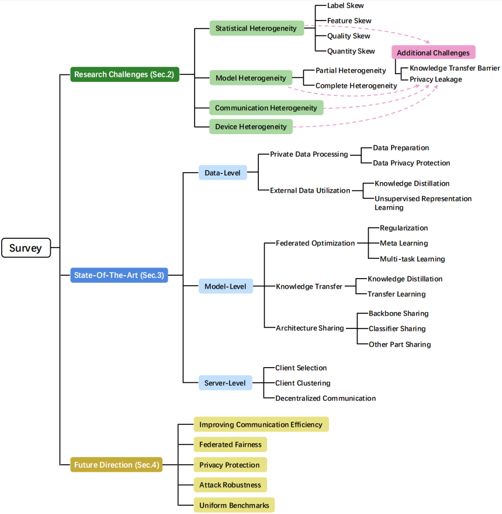
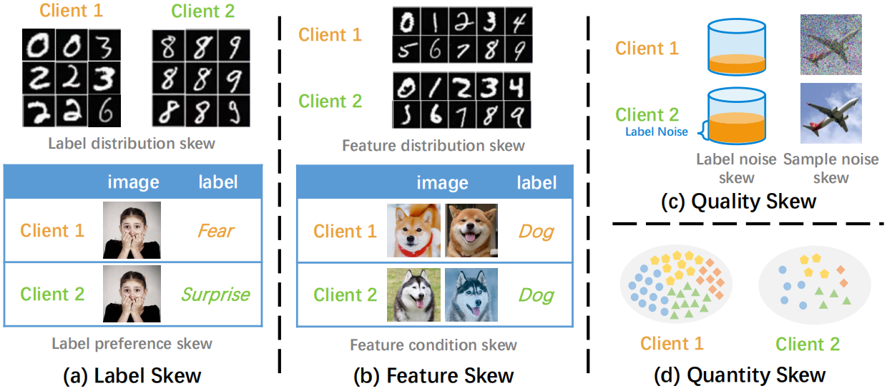

# Hetergeneous Federated Learning
> #### [Heterogeneous Federated Learning: State-of-the-art and Research Challenges](https://arxiv.org/abs/2307.10616) (Accepted to ACM Computing Surveys)
> Mang Ye, Xiuwen Fang, Bo Du, Pong C. Yuen, Dacheng Tao

Survey for Hetergeneous Federated Learning by [MARS](https://marswhu.github.io/index.html) Group at the [Wuhan University](https://www.whu.edu.cn/), led by [Prof. Mang Ye](https://marswhu.github.io/index.html).

**Table of Contents**

- [Our Works](#our-works)
  - [Federated Learning with Domain Shift](#federated-learning-with-domain-shift)
  - [Federated Learning with Heterogeneous Graph](#federated-learning-with-heterogeneous-graph)
  - [Federated Learning with Data Noise](#federated-learning-with-data-noise)
  - [Federated Learning with Few-Shot](#federated-learning-with-few-shot)
- [HFL Survey](#hfl-survey)
  - [Research Challenges](#research-challenges)
    - [Statistical Heterogeneity](#statistical-heterogeneity)
    - [Model Heterogeneity](#model-heterogeneity)
    - [Communication Heterogeneity](#communication-heterogeneity)
    - [Device Heterogeneity](#device-heterogeneity)
    - [Additional Challenges](#additional-challenges)
  - [State-Of-The-Art(Updating)](#state-of-the-art)
    - [Data-Level](#data-level)
    - [Model-Level](#model-level)
    - [Server-Level](#server-level)
  - [Future Direction(Updating)](#future-direction)
    - [Improving Communication Efficiency](#improving-communication-efficiency)
    - [Federated Fairness](#federated-fairness)
    - [Privacy Protection](#privacy-protection)
    - [Attack Robustness](#attack-robustness)
    - [Uniform Benchmark](#uniform-benchmark)

## Our Works
---------------------------------------------

### Federated Learning with Domain Shift 

- **FPL** — [Rethinking Federated Learning with Domain Shift: A Prototype View](https://openaccess.thecvf.com/content/CVPR2023/papers/Huang_Rethinking_Federated_Learning_With_Domain_Shift_A_Prototype_View_CVPR_2023_paper.pdf) *CVPR 2023* [[Code](https://github.com/WenkeHuang/RethinkFL)]

    We handle federated learning with domain shift from the prototype view.

- **FCCL** — [Learn from Others and Be Yourself in Heterogeneous Federated Learning](https://openaccess.thecvf.com/content/CVPR2022/papers/Huang_Learn_From_Others_and_Be_Yourself_in_Heterogeneous_Federated_Learning_CVPR_2022_paper.pdf) *CVPR 2022* [[Code](https://github.com/WenkeHuang/FCCL)]

    We investigate heterogeneity problems and catastrophic forgetting in federated learning.

### Federated Learning with Heterogeneous Graph 

- **FGSSL** — [Federated Graph Semantic and Structural Learning](https://marswhu.github.io/publications/files/FGSSL.pdf) *IJCAI 2023* [[Code](https://github.com/WenkeHuang/FGSSL)]

    We handle federated graph learning from node-level semantic and graph-level structure.

### Federated Learning with Data Noise
- **RHFL** — [Robust Federated Learning With Noisy and Heterogeneous Clients](https://openaccess.thecvf.com/content/CVPR2022/papers/Fang_Robust_Federated_Learning_With_Noisy_and_Heterogeneous_Clients_CVPR_2022_paper.pdf) *CVPR 2022* [[Code](https://github.com/fangxiuwen/robust_fl)]

    We deal with robust federated learning with noisy and heterogeneous clients.

- **AugHFL** — Robust Heterogeneous Federated Learning under Data Corruption *ICCV 2023* (Coming soon)

    We deal with robust heterogeneous federated learning under data corruption.

### Federated Learning with Few-Shot
- **FSMAFL** — [Few-Shot Model Agnostic Federated Learning](https://dl.acm.org/doi/10.1145/3503161.3548764) *ACMMM 2022* [[Code](https://github.com/FangXiuwen/FSMAFL)]

    We study a challenging problem, namely few-shot model agnostic federated learning.

## HFL Survey
------------------------------------------------------
### Overview

### Research Challenges
> #### Statistical Heterogeneity
Statistical heterogeneity refers to the case where the data distribution across clients in federated learning is inconsistent and does not obey the same sampling, i.e., Non-IID.

> #### Model Heterogeneity
Model heterogeneity refers to the fact that in federated learning, participating clients may have local models with different architectures.

> #### Communication Heterogeneity
The devices are typically deployed in different network environments and have different network connectivity settings (3G, 4G, 5G, Wi-Fi), which leads to inconsistent communication bandwidth, latency, and reliability, i.e., communication heterogeneity.

> #### Device Heterogeneity
The differences in device hardware capabilities (CPU, memory, battery life) may lead to different storage and computation capabilities, which inevitably lead to device heterogeneity.

> #### Additional Challenges
***Knowledge Transfer Barrier***

Federated learning aims to transfer knowledge among different clients to collaboratively learn models with superior performance. However, the four heterogeneities mentioned above will cause knowledge transfer barriers.

***Privacy Leakage***
  
Federated learning by itself cannot guarantee perfect data security, as there are still potential privacy risks. Moreover, the above-mentioned four types of heterogeneity inevitably exacerbate privacy leakage in different learning stages. 

### State-Of-The-Art
> #### Data-Level

***Private Data Processing***
1. **Data Preparation**
- **Safe** — [Safe: Synergic Data Filtering for Federated Learning in Cloud-Edge Computing](https://ieeexplore.ieee.org/abstract/document/9847342) *IEEE TII 2022*

    Safe detects and filters out poisoned data from attacked devices through a clustering algorithm.

- **FedMix** — [FedMix: Approximation of Mixup under Mean Augmented Federated Learning](https://arxiv.org/abs/2107.00233) *ICLR 2021*

    FedMix performs data augmentation based on the MixUp strategy.

- **Astraea** — [Astraea: Self-Balancing Federated Learning for Improving Classification Accuracy of Mobile Deep Learning Applications](https://arxiv.org/pdf/1907.01132.pdf) *ICCD 2019*

    Astraea performs data augmentation based on the global data distribution, generated by collecting the local data distribution.

- **FAug** — [Communication-Efficient On-Device Machine Learning: Federated Distillation and Augmentation under Non-IID Private Data](https://arxiv.org/pdf/1811.11479.pdf) *NeurIPS 2018 Workshop*

    FAug studies the trade-off between privacy leakage and communication overhead through a GAN-based data augmentation scheme.

2. **Data Privacy Protection**

- **PLDP-PFL** — [Communication-Efficient On-Device Machine Learning: Federated Distillation and Augmentation under Non-IID Private Data](https://ieeexplore.ieee.org/abstract/document/9082603) *IEEE IoT 2020*

    PLDP-PFL performs personalized differential privacy according to the sensitivity of private data.

- **A Syntactic Approach for Privacy in FL** — [Anonymizing Data for Privacy-Preserving Federated Learning](https://arxiv.org/pdf/2002.09096.pdf)

    They use anonymization technology to desensitize local private data.

***External Data Utilization***
1. **Knowledge Distillation**
2. **Unsupervised Representation Learning**

> #### Model-Level

  ***Federated Optimization***
- **Regularization**
- **Meta Learning**
- **Multi-task Learning**

  ***Knowledge Transfer***
- **Knowledge Distillation**
- **Transfer Learning**

  ***Architecture Sharing***
- **Backbone Sharing**
- **Classifier Sharing**
- **Other Part Sharing**

> #### Server-Level

- **Client Selection**
- **Client Clustering**
- **Decentralized Communication**

### Future Direction
> #### Improving Communication Efficiency

> #### Federated Fairness

> #### Privacy Protection

> #### Attack Robustness

> #### Attack Methods
- **DBA** — [DBA: Distributed Backdoor Attacks against Federated Learning](https://openreview.net/pdf?id=rkgyS0VFvr) *ICLR 2020*

DBA strategy decomposes a global trigger into local triggers, and injects them into multiple malicious clients.

- **Edge-case backdoors** — [Attack of the Tails: Yes, You Really Can Backdoor Federated Learning](https://proceedings.neurips.cc/paper_files/paper/2020/file/b8ffa41d4e492f0fad2f13e29e1762eb-Paper.pdf) *NeurIPS 2020*

Edge-case backdoors consider poisoning edge-case samples (the tail data of the data distributions). 

> #### Defense strategies
- **CRFL** — [CRFL: Certifiably Robust Federated Learning against Backdoor Attacks](http://proceedings.mlr.press/v139/xie21a/xie21a.pdf) *ICML 2021*

CRFL improves the robustness against backdoor attacks by clipping the model and adding smooth noise.

- **RBML-DFL** — [A Blockchain-based Multi-layer Decentralized Framework for Robust Federated Learning](https://ieeexplore.ieee.org/abstract/document/9892039) *IJCNN 2022*

RBML-DFL can prevent central server failures or malfunctions through blockchain encrypted transactions. 

- **ResSFL** — [ResSFL: A Resistance Transfer Framework for Defending Model Inversion Attack in Split Federated Learning](https://openaccess.thecvf.com/content/CVPR2022/papers/Li_ResSFL_A_Resistance_Transfer_Framework_for_Defending_Model_Inversion_Attack_CVPR_2022_paper.pdf) *CVPR 2022*

ResSFL is trained by experts through attacker perception to obtain a resistant feature extractor that can initialize the client models.

- **Soteria** — [Soteria: Provable Defense against Privacy Leakage in Federated Learning from Representation Perspective](https://openaccess.thecvf.com/content/CVPR2021/papers/Sun_Soteria_Provable_Defense_Against_Privacy_Leakage_in_Federated_Learning_From_CVPR_2021_paper.pdf)

Soteria performs attack defense by generating perturbed data representations, thereby decreasing the quality of reconstructed data.

- **BaFFLe** — [BaFFLe: Backdoor Detection via Feedback-based Federated Learning](https://arxiv.org/pdf/2011.02167.pdf)

The server trains backdoor filters and sends them randomly to clients to identify and remove backdoor instances.

> #### Uniform Benchmark
> #### General Federated Learning Systems
- **FedML** — [FedML: A Research Library and Benchmark for Federated Machine Learning](https://arxiv.org/abs/2007.13518)

FedML is an research library that supports distributed training, mobile on-device training, and stand-alone simulation training. It provides standardized implementations of many existing federated learning algorithms, and provides standardized benchmark settings for a variety of datasets, including Non-IID partition methods, number of devices and baseline models.

- **FedScale** — [FedScale: Benchmarking Model and System Performance of Federated Learning at Scale](https://proceedings.mlr.press/v162/lai22a.html) *ICML 2022*

FedScale is a federated learning benchmark suite that provides real-world datasets covering a wide range of federated learning tasks, including image classification, object detection, language modeling, and speech recognition. Additionally, FedScale includes a scalable and extensible FedScale Runtime to enable and standardize real-world end-point deployments of federated learning.

- **OARF** — [The OARF Benchmark Suite: Characterization and Implications for Federated Learning Systems](https://dl.acm.org/doi/full/10.1145/3510540) *ACM TIST 2020*
  
OARF leverages public datasets collected from different sources to simulate real-world data distributions. In addition, OARF quantitatively studies the preliminary relationship among various design metrics such as data partitioning and privacy mechanisms in federated learning systems.

- **FedEval** — [FedEval: A Holistic Evaluation Framework for Federated Learning](https://arxiv.org/abs/2011.09655)

FedEval is a federated learning evaluation model with five metrics including accuracy, communication, time consumption, privacy and robustness. FedEval is implemented and evaluated on two of the most widely used algorithms, FedSGD and FedAvg.
  
> #### Specific Federated Learning Systems
- **FedReIDBench** — [Performance Optimization of Federated Person Re-identification via Benchmark Analysis](https://dl.acm.org/doi/abs/10.1145/3394171.3413814) *ACM MM 2020*

FedReIDBench is a new benchmark for implementing federated learning to person ReID, which includes nine different datasets and two federated scenarios. Specifically, the two federated scenarios are federated-by-camera scenario and federated-by-dataset scenario, which respectively represent the standard server-client architecture and client-edge-cloud architecture.

- **pFL-Bench** — [pFL-Bench: A Comprehensive Benchmark for Personalized Federated Learning](https://proceedings.neurips.cc/paper_files/paper/2022/hash/3cc03e19fed71a2b9347d83921ca2e7d-Abstract-Datasets_and_Benchmarks.html) *NeurIPS 2022 Datasets and Benchmarks Track*

pFL-Bench is a benchmark for personalized federated learning, which covers twelve different dataset variants, including image, text, graph and recommendation data, with unified data partitioning and realistic heterogeneous settings. And pFL-Bench provides more than 20 competitive personalized federated learning baseline implementations to help them with standardized evaluation.

- **FedGraphNN** — [FedGraphNN: A Federated Learning System and Benchmark for Graph Neural Networks](https://arxiv.org/abs/2104.07145) *ICLR 2021 Workshop on DPML*

FedGraphNN is a benchmark system built on a unified formulation of graph federated learning, including extensive datasets from seven different fields, popular Graph Neural Network (GNN) models and federated learning algorithms.

> #### Datasets
- **LEAF** — [LEAF: A Benchmark for Federated Settings](https://arxiv.org/abs/1812.01097) *NeurIPS 2019 Workshop*

LEAF contains 6 types of federated datasets covering different fields, including image classification (FEMNIST, Synthetic Dataset), image recognition (Celeba), sentiment analysis (Sentiment140) and next character prediction (Shakespeare, Reddit). In addition, LEAF provides two sampling methods of 'IID' and 'Non-IID' to divide the dataset to different clients.

- **Street Dataset** — [Real-World Image Datasets for Federated Learning](https://arxiv.org/abs/1910.11089) *FL-NeurIPS 2019*

This work introduces a federated dataset for object detection. The dataset contains over 900 images generated from 26 street cameras and 7 object categories annotated with detailed bounding boxes. Besides, the article provides the data division of 5 or 20 clients, in which their data distribution is Non-IID and unbalanced, reflecting the characteristics of real-world federated learning scenarios.
